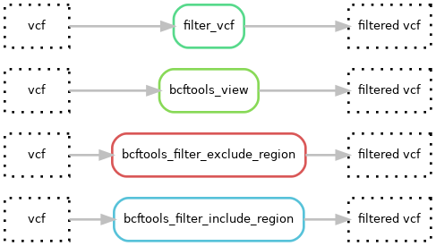

# Hydra-genetics filtering
The filtering module consist of a set of rules designed to remove or flag variants in a VCF file. In this project, each rules output is constructed by a generic file wildcard, followed by a string indicating the intended rule and a wildcard segment defining the applied settings.

 

output file: `{file}`.`RULE_GUIDING_STRING`.`{tag}`.vcf

 

* `file`: wildcard with path and file name
* `RULE_GUIDING_STRING`: string specifying which rule to apply (include, exclude, bcftools_view or filter)
* `{tag}`: wildcard that will point to an entry in your config

## Dag graph

## Module input files

* `{file}.vcf.gz`

## Module output files

* `{file}.include.{tag}.vcf.gz`
* `{file}.exclude.{tag}.vcf.gz`
* `{file}.bcftools_view.{tag}.vcf`
* `{file}.filter.{tag}.vcf`
